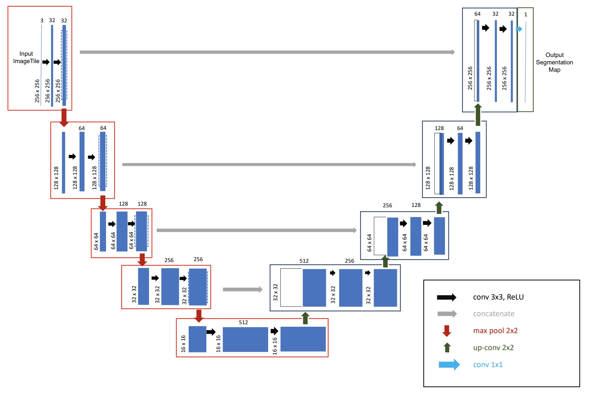
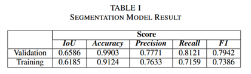
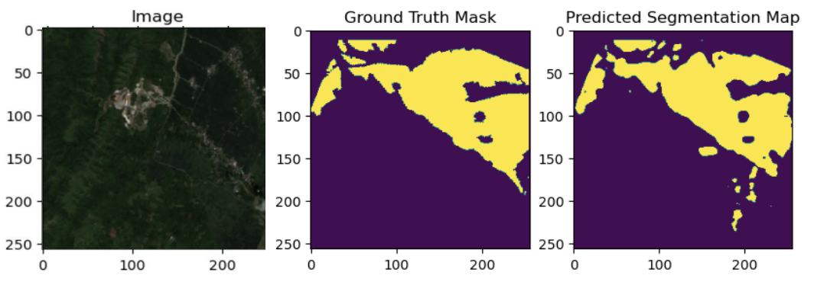
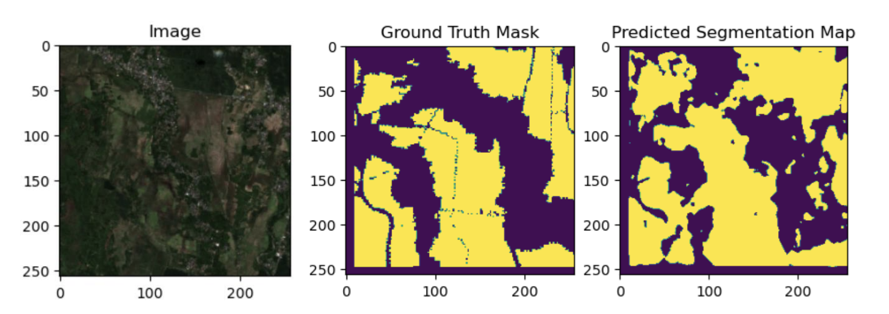
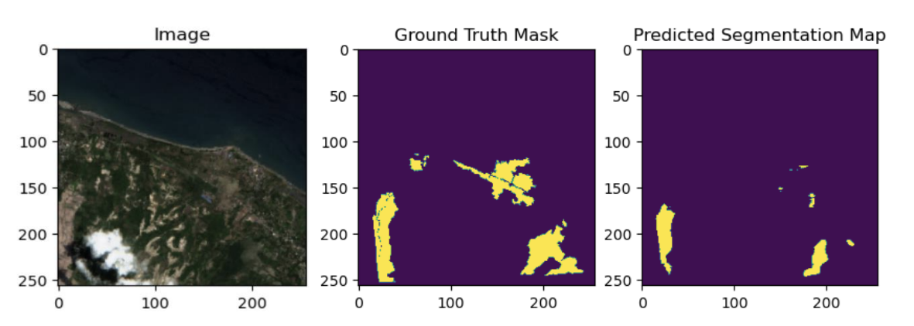
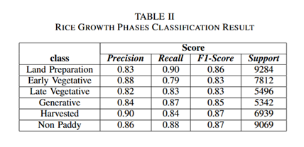
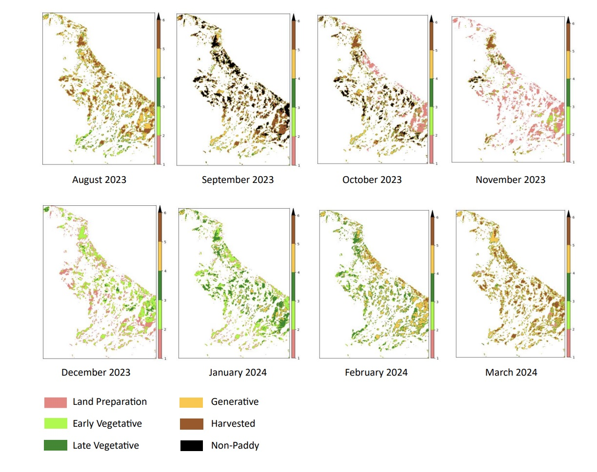
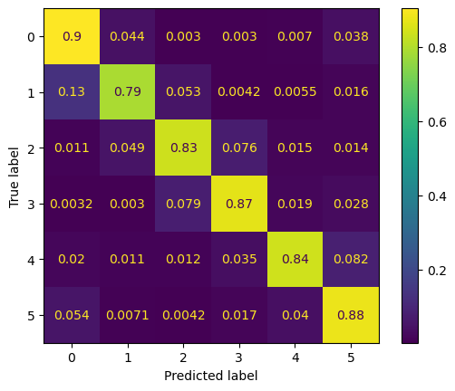

# Semantic Segmentation of Sentinel-2 Satellite Image for Rice Growth Phase Classification Using Deep Learning
This repository contains the code and configuration files to reproduce the semantic segmentation results using U-Net and Classification CNN models, focusing on satellite imagery analysis of rice fields. Included are pre-trained models for semantic segmentation of satellite images into rice field areas and classification of rice growth stages (land preparation, early vegetative, late vegetative, generative, and harvested).

For a comprehensive explanation of the methodology, experimental setup, and results, please refer to our IEEE conference paper:
[Semantic Segmentation of Sentinel-2 Satellite Image for Rice Growth Phase Classification Using Deep Learning](https://ieeexplore.ieee.org/document/10759168.)

## Dataset Sources

To train and test the models, we used data provided by the European Space Agency (ESA) from the ESA NOR project, consisting of Sentinel-2 satellite images. For the classification of rice growth stages, we utilized the rice growth dataset from the ASF survey conducted by BPS.

Initially, the dataset contained many classes. We reduced the number of classes to six, focusing on those relevant to rice growth phases and non-rice areas, which are:

1. Land preparation  
2. Early vegetative  
3. Late vegetative  
4. Generative  
5. Harvested  
6. Non-paddy (non-rice area)

## Architecture U-Net
The U-Net architecture employed in this project is used to perform semantic segmentation of satellite images to distinguish between paddy (rice field) and non-paddy areas. The model's contracting and expanding paths enable effective feature extraction and precise boundary localization, which are crucial for accurately segmenting agricultural land from other land covers.


## Main Result
### Evaluation of The U-Net Model:



Sample results that are accurate to the input image (left), ground truth label (left) and predicted map (right).




Sample results that are fairly accurate to the input image (left), ground truth label (left) and predicted map (right).


### Evaluation of The CNN Model: 



Spatio temporal distribution of rice growth phases object-based
classification


### Confusion Matrix
Evaluation based on the six classes - class 0 for Land Preparation, class 1 for Early Vegetative, and class 2 for Late Vegetative - class 3
for generative, class 4 for harvested and class 5 for non-paddy of the confusion matrix of rice growth phase classification.
1. For land preparation, an accuracy of 90% is obtained with very small prediction errors to early Vegetative (4.4%).
2. For early vegetative, retrieved an accuracy of 79%, with a prediction error to late vegetative (5.3%).
3. For late vegetative, with 83% accuracy, prediction error to generative (7.6%).
4. For generative, with an accuracy of 87%, prediction errors quite scattered to other classes.
5. For harvested phase, with an accuracy of 84%, with the main prediction error to non paddy (8.2%).
6. For non-paddy, with an accuracy of 88%, with the main prediction error to land preparation (5.4%).


## Citing this work
For the complete description of this work, please refer to the [IEEE paper](https://ieeexplore.ieee.org/document/10759168.). If you use this work, please cite it:

```bibtex
@inproceedings{10759168,
  author={Mubarok, Moh. Jabir and Yuniarno, Eko Mulyanto and Sihombing, Yogie Oktavianus and Purnomo, Mauridhi Hery},
  booktitle={2024 IEEE International Conference on Imaging Systems and Techniques (IST)}, 
  title={Semantic Segmentation of Sentinel-2 Satellite Image for Rice Growth Phase Classification Using Deep Learning}, 
  year={2024},
  volume={},
  number={},
  pages={1-6},
  keywords={Accuracy;Sensitivity;Satellites;Computational modeling;Semantic segmentation;Predictive models;Satellite images;Internet;Remote sensing;Monitoring;satellite image;semantic segmentation;classification;U-Net;rice growth phase},
  doi={10.1109/IST63414.2024.10759168}}


